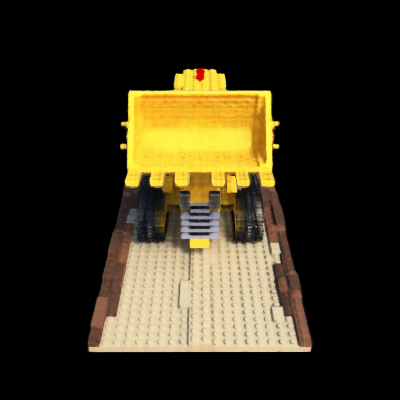
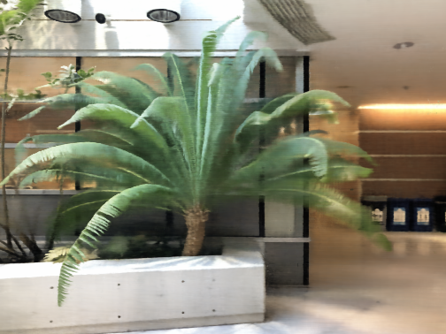
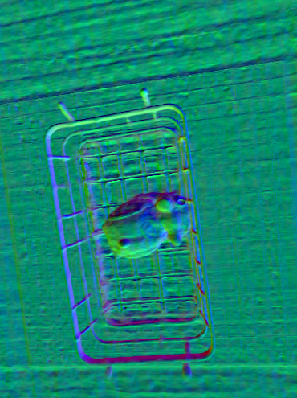
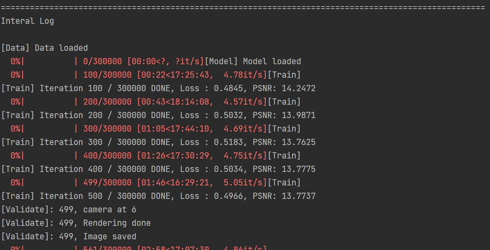

# Dashboard

1. 현재 지원하는 모델 :
    - NeRF 
    - NeUS
    - HyperNeRF(TBD)

2. 퍼포먼스 :

|Criteria|Nerf|Neus|
|:---:|:---:|:---:|
|학습 속도|4it/s|5it/s|
|렌더링 속도|21s/img|60s/img|   

- NeRF

Data : SYNTHETIC/lego

Data : SYNTHE/fern

- NeUS

Data : SYNTHE/neus_thin_structure/thin_catbus 

(300000 epochs)

# Progress

- 230426 : NeRF 동작 확인

  
- 230429 : NeUS 동작 확인

# Process
## Iteration
1. Batch : H*W개의 ray에서 indexing으로 N_rand개의 ray를 iteration마다 학습에 사용.
   - 이 때 batch랑 실제 이미지에서 pixel에 해당하는 값이 matching을 해야해서 prpare_ray_batching과 sample_ray_batch에서 보면 indexing으로 가져가게 한다.
2. Chunk :  한 batch에서 chunk만큼 한번에 nerf 모델에 입력하여 예측하도록 하는 단위
3. Netchunk : Chunk를 가지고 forward할 때 1024*64의 크기만큼 forward를 진행. 이는 GRAM의 사용과 관련있을 것으로 보임

## Overall
1. Load Dataset
2. Load Model
3. Load Rendering
4. Ray Generation
    - Pre process : Batch sampling or Random sampling
    - Post process : Update rays w.r.t ndc, use_viewdirs and etc
5. Ray Colorization
    - Preprocess : Make rays to be used for model
    - Volumetric Rendering : Run network and then rendering(raw2output). Hierarchical sampling implemented.
    - Post process : aggregate chunk into and batch and backpropagation

## NeRF Studio API
사용시 문제점
- 기본적으로 지원하는 GPU는 제한적.(docker를 사용하든 manual로 설치하든 cuda 11.8부터 사용이 가능할 것 같다.) 

### Overview
- 현재 지원하고 있는 모델 
    - Instant-NGP, K-Planes, Mip-NeRF, NeRF, TensoRF and etc.
- 주요 component
    - [Camera model](https://docs.nerf.studio/en/latest/nerfology/model_components/visualize_cameras.html)
        - 기본적인 카메라 모델에서 다루는 요소들
        - Instrinsic/Extrinsic
        - Equirectangular/Spherical Camera Model
        - Distortion Parameters
    - [Sample representation](https://docs.nerf.studio/en/latest/nerfology/model_components/visualize_samples.html)
        - NeRF에서 핵심이 되는 volumetric rendering 관련 내용
    - [Ray samplers](https://docs.nerf.studio/en/latest/nerfology/model_components/visualize_samplers.html)
        - Volumetric Rendering을 진행하기 위해서 ray를 해당 direction에서 sampling을 해야할 때 다루는 내용
        - Strafied Sampling, Heirarchical Sampling 
    - [Spatial distortions](https://docs.nerf.studio/en/latest/nerfology/model_components/visualize_spatial_distortions.html)
        - 단순히 물체 rendering만 하는 것이 아니라, scene을 rendering하기 위해서 spatial distortion을 처리할 필요가 존재.
        - (TBD) 향후 scene rendering 모델을 다루게 될 때 다시 방문하도록
    - [Encoders](https://docs.nerf.studio/en/latest/nerfology/model_components/visualize_encoders.html)
        - Positional Encoding을 포함해서 여러 pixel들의 위치 정보를 나타내는 방식

### Pipeline

- 여기서 Model을 제외하고 DataManager에 해당하는 것만 사용할 계획
    - NOTE! RayGT and RayOutputs are currently dictionaries. In the future, they will be typed objects.
- 주요 Component
    - RayBundles
        - the input to the forward pass of the Model. needed for both training and inference time
        - origin과 viewing directions을 표현하고, rendering으로 이어지게 된다.
    - RayGT objects, however, are needed only during training to calculate the losses in the Loss Dict.
        - pixel과 같은 ground truth 정보를 포함해서 Loss 계산에 사용하게 된다.

## HyperNeRF Process
사용시 문제점
- 현재 가지고 있는 파이프라인을 사용은 가능하나, 데이터 처리가 HyperNeRF에 의존적이다.(Dataset이 맞춰져 있다.)

# Log
## Performance, Error
### NeRF
- [230420, ray] : ray.get_rays_np()에서 기존 구현에서 문제가 있었던 것 수정
- [230420, model] : Embedding에서 multries에 따라서 model 구조가 달라지고 있었음
### NeUS
- [230429, model] : 현재 update가 느리게 혹은 안되고 있는데 이게 자연스러운 현상인지 확인해야 함.  
    - far, near, rays_o값이 이상함. dataset에서 pose_all과 intrinsic_inv를 사용하는 것과 c2w, w2c와 충돌 문제로 보임
    - [230523] 현재 조정해서 적절히 나오는 것으로 판단
- [230611, inference] 현재 이미지가 되게 둥글둥글 나오게 되는데, 구현상으로 보면 gradient(nabla 혹은 normal)에서 clamp로 값의 범위를 한정하게 되는데, 이게 결국 smoothign과 연관되지 않을까 생각

## Profiling
### NeRF
- [230419, ray generation] : 현재 foward pass는 3.3it/s로 최적화 함
- [230419, render image] : redering.render_image()에서 render_rays가 2초 * chunk 3개 ~ 7s정도가 나오는 것 확인. 이는 ray가 H*W개를 만들어서 하다보니 render_rays()에서 ray 개수에 linear하게 시간이 증가한 것으로 봄
    - Render_rays 최적화 하기
- [230419, render image] : render pose 당 21s로 확인됨. 
- [230419, OOM] : Forward pass에서 내부 연산이후 아직 세션이 연결되어 있다보니 torch cache를 비우지 않으면 OOM이 나오는 상황.
    - back prop 이후에 cache 비우기
- [230419, OOM] Run network에서 1.6G정도 사용
- [230419, pose matrix]: LLFF dataset에서 Pose matrix를 처리할 때 transpose하여 진행하는 것이 존재. (LLFF.load_matrices()참고) 
    - 이렇게굳이 하는 이유를 파악해서 정리하기

### NeUS
- [230429, OOM] 현재 batch_size 512에서 OOM이 확인. 현재 256으로 약 6GB 사용.
- [230602, Model] NeRF가 항상 사용되는 것은 아니고 config 중 n_outside를 1이상 지정시 사용.
    - 1) NeuSRenderer.render에서 background_alpha를 계산할 때 사용
    - 2) NeuSRenderer.render_core에서 sampled_color 계산시 사용. 이 값이 최종 예측한 color 값

## Parameter effect
### NeUS
- [230420, shuffling] : ray.prepare_ray_batching()에서 np.random.shuffle(rays_rgb)을 하지 않게 되면 이상하게 나옴

## Bottleneck
- ray generation, batch size dependent
- render ray, img size dependent

  
# References
1. pytorch repo : [link](https://github.com/yenchenlin/nerf-pytorch/tree/1f064835d2cca26e4df2d7d130daa39a8cee1795)
2. volumetric rendering in NeRF [link](https://keras.io/examples/vision/nerf/)
3. Camera calibration [link](https://www.mathworks.com/help/vision/ug/camera-calibration.html)
4. NeUS [link](https://github.com/Totoro97/NeuS/tree/6f96f96005d72a7a358379d2b576c496a1ab68dd)
5. NeRF Studio
    - [blog](https://xoft.tistory.com/26), [Docs](https://docs.nerf.studio/en/latest/index.html)
    
    
